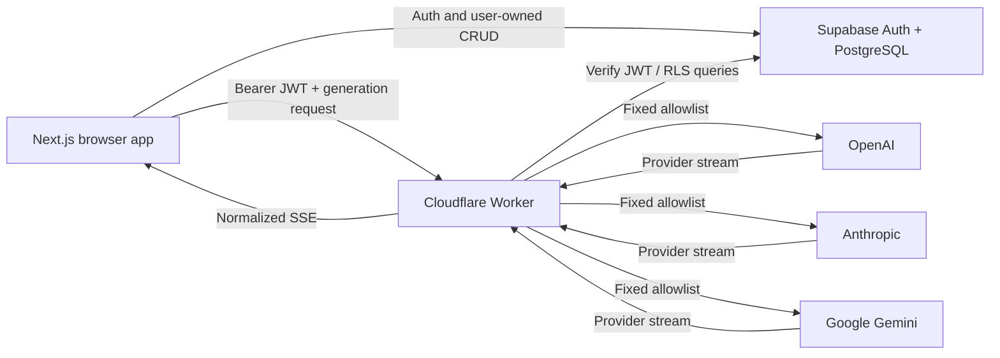

# Orbit

Orbit is an open-source chat interface for using and comparing OpenAI, Anthropic, and Google Gemini from one focused application. Users can select a model, let a deterministic benchmark-informed router choose one, or intentionally compare all three responses side by side.

## Architecture



The browser never receives provider credentials. Conversation data is accessed with the caller's Supabase token and protected by Row Level Security. The Worker verifies the JWT, validates the request, applies user and IP rate limits, selects an allowlisted model, normalizes provider streaming, and persists completed assistant messages.

## Supported models

- OpenAI: `gpt-5.6-sol`
- Anthropic: `claude-opus-5`
- Google: `gemini-3.7-flash`

These IDs were verified against official provider documentation on September 1, 2026. They are intentionally held in one server-side registry.

## Auto routing

Orbit classifies prompts into exactly five categories: coding, math, reasoning, long-context, and general. It then scores enabled models using the versioned snapshot in `packages/router/src/benchmarks`. Capability contributes 94% of the score; speed contributes 4% and cost 2%, keeping quality dominant.

The snapshot is updated through a reviewed code change, not runtime scraping. See [docs/benchmarks.md](docs/benchmarks.md) for sources and limitations.

## Data model

`conversations` belong to `auth.users`; `messages` belong to conversations. RLS policies verify ownership for every operation. No profile, analytics, quota, or raw-provider-response tables are used.

## Security model

- Provider keys are Cloudflare Secrets.
- The Gemini API key may be bound to a dedicated Google service account when required by Google Cloud policy; the account needs no broad project role.
- Model IDs and provider URLs are server-owned allowlists.
- Supabase JWTs are verified against project JWKS with issuer and audience checks.
- Database writes use the caller's token and remain subject to RLS.
- Request bodies are capped at 256 KiB and schema validated.
- CORS uses an exact origin allowlist.
- Markdown output is rendered with raw HTML disabled.
- Logs contain request metadata and normalized error categories, never prompts, responses, keys, or auth tokens.
- Public demo limits are 5 provider calls per user per minute, 2 per 10-second burst, and 30 per IP per minute. Comparison charges one unit per provider.
- Paid provider calls are never retried or silently failed over.

## Local development

Requirements: Node.js 24, pnpm 11, a Supabase project, and a Cloudflare account.

```bash
pnpm install
cp .env.example .env.local
```

Set the four public values in `.env.local`, then copy or link them for the web app:

```bash
cp .env.local apps/web/.env.local
```

Set Worker development variables without committing them:

```bash
cd apps/worker
pnpm exec wrangler secret put SUPABASE_URL
pnpm exec wrangler secret put SUPABASE_PUBLISHABLE_KEY
pnpm exec wrangler secret put OPENAI_API_KEY
pnpm exec wrangler secret put ANTHROPIC_API_KEY
pnpm exec wrangler secret put GOOGLE_API_KEY
pnpm exec wrangler secret put ALLOWED_ORIGINS
```

Apply the database migration, then run the two processes:

```bash
supabase link --project-ref YOUR_PROJECT_REF
supabase db push
pnpm dev
pnpm dev:worker
```

Open `http://localhost:3000`.

## Tests

```bash
pnpm test
pnpm typecheck
pnpm build
```

Provider tests use mocked SSE streams and never consume API credits.

## Deployment

Deploy `apps/web` as the Vercel project root. Configure the four `NEXT_PUBLIC_*` values from `.env.example` in Vercel.

Deploy `apps/worker` with Wrangler after configuring its seven secrets. The included `wrangler.jsonc` creates the three approved rate-limit bindings. Add the production Vercel origin to `ALLOWED_ORIGINS`, and configure the resulting Worker URL as `NEXT_PUBLIC_WORKER_URL` in Vercel.

For Supabase Auth, set the Vercel deployment as the Site URL and add both production and local `/auth/callback` redirect URLs. Enable email confirmation and Google as the only external OAuth provider.

## Adding a provider

Adding a provider is intentionally not a plug-in system. Add one adapter implementing the small `ProviderAdapter` interface, add an allowlisted model and benchmark record, then add provider transformation and stream normalization tests.

## Deliberate v1 exclusions

Orbit does not use AI Gateway, Durable Objects, queues, RAG, vector databases, billing, runtime benchmark scraping, LLM-based routing, silent retries, response caching, microservices, or repository/service layers.
