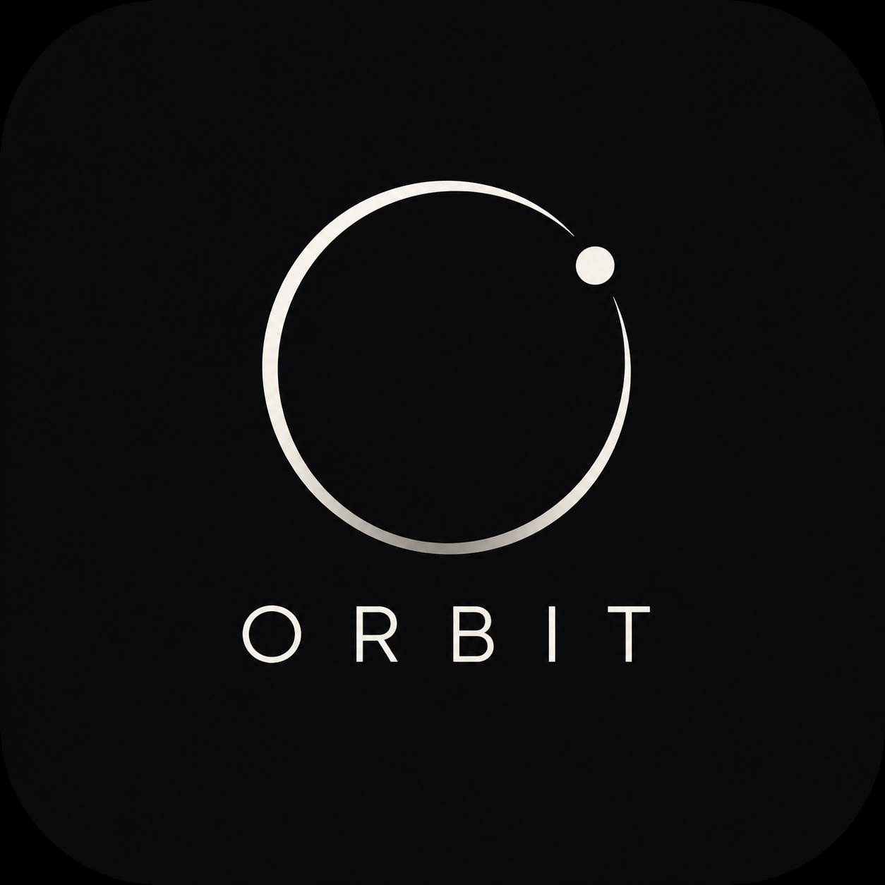
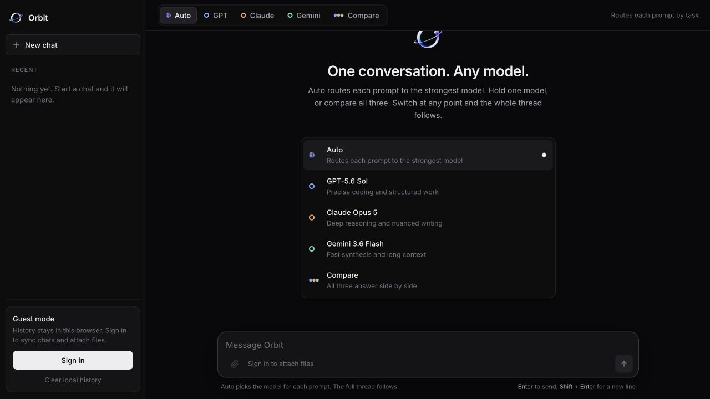
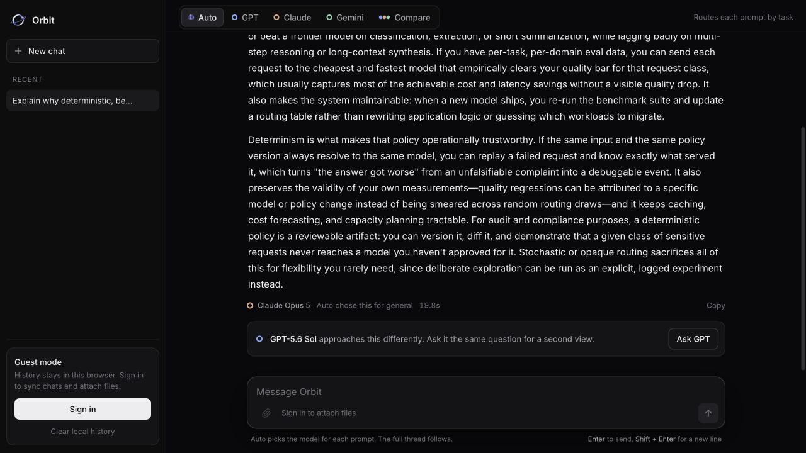
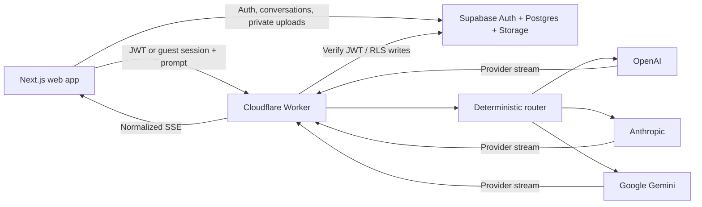

<div align="center">
  
  <h1>Orbit</h1>
  <p><strong>One conversation. Any model.</strong></p>
  <p>
    A production multi-model AI interface that routes prompts by capability,<br />
    preserves context across providers, and compares frontier models side by side.
  </p>
  <p>
    <a href="https://orbitmodels.dev"><strong>Try Orbit live</strong></a>
    ·
    <a href="#how-auto-routing-works">How routing works</a>
    ·
    <a href="#run-locally">Run locally</a>
  </p>
  <p>
    
    
    
    
  </p>
</div>



## Why Orbit

Most multi-model interfaces make the user choose a provider before they know which model fits the task. Orbit treats model selection as a product and systems problem:

- **Auto** classifies each prompt as coding, math, reasoning, long-context, or general, then selects the strongest model from a versioned benchmark snapshot.
- **Manual mode** lets the user hold GPT, Claude, or Gemini for as long as they want.
- **Compare** streams all three answers side by side for deliberate evaluation.
- **Context follows the conversation** when the selected provider changes.
- **Second-view recommendations** suggest a complementary model without silently spending credits or replacing the original answer.

Guests can try the core experience immediately. Authentication adds synchronized conversations and private multimodal attachments.

## Auto routing in action



The routing decision is visible beside every Auto response. Orbit never hides a provider switch, silently retries a paid call, or uses an LLM to decide which LLM to call.

## How Auto routing works

```text
Prompt + conversation size
          │
          ▼
Deterministic task classifier
          │
          ├── coding
          ├── math
          ├── reasoning
          ├── long-context
          └── general
          │
          ▼
Versioned benchmark scorecard
          │
          ▼
Quality-first model selection
          │
          ▼
Allowlisted provider adapter → normalized SSE stream
```

Capability contributes **94%** of the routing score. Speed contributes 4% and cost 2%, so quality drives the choice and operational factors only resolve close results. Benchmark data is reviewed and versioned in the repository instead of scraped at runtime, making every routing decision reproducible and testable.

See [the benchmark methodology](docs/benchmarks.md) and the [versioned scorecard](packages/router/src/benchmarks/2026-09.json).

## Architecture



The browser never receives provider credentials. The Worker validates requests, enforces rate limits, selects only server-allowlisted models, transforms attachments into provider-native formats, normalizes three different streaming protocols, and persists completed responses for authenticated users.

### Repository layout

```text
apps/
  web/          Next.js interface, auth, guest history, streaming UI
  worker/       Cloudflare API, security boundary, provider adapters
packages/
  contracts/    Shared request and response types
  router/       Classifier, benchmark snapshot, scoring logic
supabase/
  migrations/   Schema, RLS policies, attachment constraints
docs/           Architecture and benchmark decisions
```

## Supported models

| Provider | Production model | Role in Orbit |
| --- | --- | --- |
| OpenAI | `gpt-5.6-sol` | Coding and structured work |
| Anthropic | `claude-opus-5` | Deep reasoning and nuanced writing |
| Google | `gemini-3.6-flash` | Fast synthesis and long context |

Model IDs live in one server-side allowlist. The current IDs were verified against official provider documentation on September 1, 2026.

## Security and reliability

- Provider credentials are stored as Cloudflare secrets and never shipped to the client.
- Supabase JWTs are verified against project JWKS with issuer and audience checks.
- Authenticated database and storage access remains subject to Row Level Security.
- Attachments use private owner-prefixed paths and strict MIME, count, and size limits.
- Request bodies are schema-validated and capped at 256 KiB.
- CORS uses an exact production-origin allowlist.
- Raw HTML is disabled in rendered Markdown.
- Logs exclude prompts, responses, credentials, and authentication tokens.
- Public traffic is limited per user/guest and per IP; Compare is charged as three provider calls.
- Paid calls are never silently retried or failed over to another model.

## Run locally

### Requirements

- Node.js 24
- pnpm 11
- Supabase project
- Cloudflare account
- API keys for the providers you enable

```bash
pnpm install
cp .env.example apps/web/.env.local
```

Set the four public web values in `apps/web/.env.local`. Then configure Worker development secrets:

```bash
cd apps/worker
pnpm exec wrangler secret put SUPABASE_URL
pnpm exec wrangler secret put SUPABASE_PUBLISHABLE_KEY
pnpm exec wrangler secret put OPENAI_API_KEY
pnpm exec wrangler secret put ANTHROPIC_API_KEY
pnpm exec wrangler secret put GOOGLE_API_KEY
pnpm exec wrangler secret put ALLOWED_ORIGINS
```

Apply the schema and start the web app and Worker in separate terminals:

```bash
supabase link --project-ref YOUR_PROJECT_REF
supabase db push

pnpm dev
pnpm dev:worker
```

Open `http://localhost:3000`.

## Verification

```bash
pnpm test
pnpm typecheck
pnpm build
```

The test suite covers routing classification and scoring, guest and authenticated access boundaries, rate-limit accounting, Compare behavior, provider allowlists, request limits, history persistence, stream parsing, and core UI states. Provider tests use mocked streams and do not consume API credits.

## Deliberate v1 boundaries

Orbit intentionally avoids AI Gateway, Durable Objects, queues, RAG, vector databases, billing, runtime benchmark scraping, LLM-based routing, response caching, silent retries, microservices, and unnecessary repository/service layers. The goal is a system that is straightforward to reason about, test, and explain.

## Author

Built by [Kebron Tadesse](https://github.com/tenth-package0).
